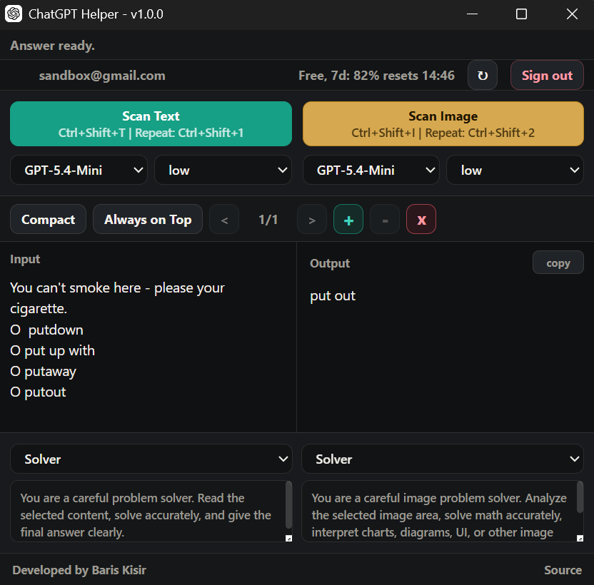

# ChatGPT Helper

ChatGPT Helper is a compact Tauri desktop assistant for working with ChatGPT from your desktop. After ChatGPT sign-in, it can answer manual input, scan selected Windows screen areas with local OCR, and analyze selected image areas.

Chrome Extension -> https://github.com/bariskisir/ChatGPTChromeHelper




---

## Install

1. Download the latest release for Windows from [Releases](https://github.com/bariskisir/ChatGPTHelper/releases/latest).
2. Install or extract the package.
3. Run **ChatGPT Helper**.


## Development

#### Prerequisites

- [Rust](https://rustup.rs/) stable
- Node.js 22 or newer
- Visual Studio Build Tools on Windows

```bash
git clone https://github.com/bariskisir/ChatGPTHelper
cd ChatGPTHelper

cd frontend
npm install
npm run build
cd ..

cargo run
```

## License

MIT
